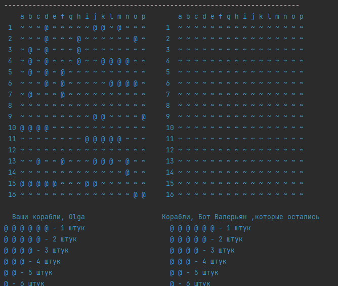

# Sea Battle

## Содержание

- [Введение](#введение)
- [Сборка проекта](#сборка-проекта)
- [Установка и настройка](#установка-и-настройка)


## Введение

Консольная игра "Морской бой"



## Сборка проекта

Для компиляции приложения в исполняемый jar-файл необходимо выполнить следующее:

1. Установить на локальный компьютер JDK не ниже 17 версии, Maven и Git.
    ```shell
    java -version  
    mvn -version
    git --version 
    ``` 

2. Загрузить исходные коды приложения на локальный компьютер с помощью Git
    ```shell
    git clone <url системы хранения исходных кодов>
    cd real-time-intelligence-desktop
    ```

3. Выполнить компиляцию проекта с помощью Maven
   ```shell
    mvn clean compile
   ```

4. Выполнить команду Maven для сборки исполняемого jar-файла
    ```shell
     mvn clean package 
    ```

Исполняемый jar-файл вида `client-<VERSION>-SNAPSHOT.jar` будет располагаться по относительному пути client\target\

[Вернуться в оглавление](#содержание)

## Установка и настройка

1. Убедитесь, что на вашем компьютере установлена JDK версии 17 или выше. Подробная инструкция по установке для вашей платформы на сайте [oracle.com](https://www.oracle.com/java/technologies/downloads/)
2. Загрузите исполняемый jar-файл приложения с сайта github.com или выполните локальную сборку по инструкции из раздела [Сборка проекта](#сборка-проекта)
3. Создайте директорию для хранения конфигурации и локальной базы данных приложения.
4. Скопируйте jar-файл в директорию, в которой создайте исполняемый файл запуска:

- Платформа Windows, run.bat
    ```shell
    SET JAVA_HOME=C:\PROGRAM FILES\JAVA\jdk-17  
    SET JAVA_EXE="%JAVA_HOME%\bin\java.exe"
    chcp 65001
    %JAVA_EXE% -Xmx1024m  -Dfile.encoding=UTF8 -jar client-1.0-SNAPSHOT.jar
    ```
- Платформа Linux, run.sh
  ```shell
    SET JAVA_HOME=C:\PROGRAM FILES\JAVA\jdk-17
    SET JAVA_EXE="%JAVA_HOME%\bin\java.exe" 
    chcp 65001
    %JAVA_EXE% -Xmx1024m -Dfile.encoding=UTF8 -jar client-1.0-SNAPSHOT.jar
  ```

  В строке **SET JAVA_HOME** необходимо прописать путь к директории где на вашем локальном компьютере установлен JDK

  Для начала работы с приложением нужно запустить исполняемый файл **run.bat/run.sh**

[Вернуться в оглавление](#содержание)